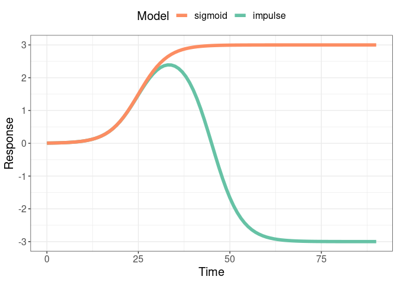

<!-- README.md is generated from README.Rmd. Please edit that file -->

# Impulse

This package implements the [Chechik &
Koller](https://www.ncbi.nlm.nih.gov/pubmed/19193146) impulse model
using TensorFlow to improve scaleability and allow for the introduction
of priors which improve model interpretability. This model describes
timeseries data using two sigmoidal responses which are sufficient to
capture the dynamics of many biological perturbations. While this model
was formulated to capture biological dynamics, the model is generally
suitable for any kind of saturation behavior described by half-max
value(s) and asymptote(s).

The core functionality of **impulse** is:

-   Simulate timecourse parameters and resulting timecourses
-   Fit sigmoid and impulse models to timecourses with or without priors
    on kinetic parameters
-   Compare sigmoid and impulse models
-   Visualize measurements and parametric fits

## The models

This package revolves around two phenomenological models, the sigmoid
(single response) and impulse (double sigmoid). The plot below
highlights the value of these models. It is easy to mentally convert
between timecourses and kinetic paramters, but the kinetic parameters
are generally more meaningful since they indicate the timing and
magnitdue of responses.

A sigmoid with parameters {t\_rise = 25, v\_inter = 3, rate = 0.25} and
an impulse with two additional parameters {t\_fall = 45, v\_final = -3}
are shown. The t\_rise of 25 indicates a half-max time of 25 and
v\_inter of 3 indicates saturation at 3. In the impulse model there is a
second response with a half-max time of 45 and final asymptote at -3.

<!-- -->

### sigmoid


### implulse


## *Impulse* functionality

### Fitting Data

The primary functionality in this package is fitting parametric models
to user-supplied timecourses. The vignette *fitting-timecourses*
simulates time series, fits multiple models to each timecourse and then
determines the model that best fits each timecourse.

### Formulating priors

The most important contribution of this work is applying priors to
impulse models since there are natural constraints on parameter values
which should hold (non-negative rates, non-negative times, rise before
fall). When these constraints are violated, a good fit may occur, but
interpretability of timing and effect sizes will be lost. The vignette
*setting\_priors* describes how to formulate the priors and can be used
to guide the tuning of parameters for other application.

## Installation

The package can be installed from GitHub using:

``` r
# install.packages("devtools")
remotes::install_github('calico/impulse')

# for vignettes
remotes::install_github('calico/impulse', build = TRUE, build_opts = c("--no-resave-data", "--no-manual"))
```

The package utilizes TensorFlow for parameter fitting so a python
distribution is required for use. This can be configured using any of
the methods discussed in
[R-TensorFlow](https://github.com/rstudio/tensorflow), but using Conda
(e.g., [Miniconda](https://docs.conda.io/en/latest/miniconda.html)) is
straight-forward to configure. Conda can be installed using:

``` r
remotes::install_github('rstudio/reticulate')
reticulate::install_miniconda()
```

Once conda and impulse are installed, A conda environment configured
with TensorFlow can be created using:

``` r
auto_config_tf()
```
